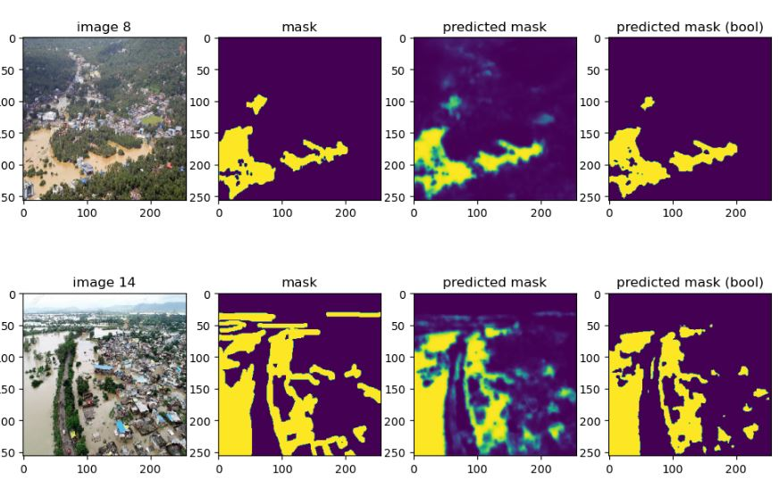

# Flood-Area-Segmentation
This notebook includes training a model for <a href="https://www.kaggle.com/competitions/playground-series-s3e5"> flood area segmentation </a>. The model is based on the classic U-Net CNN architecture with input size of 256x256x3. 
Training was done with augmented data generated using the Albumentations library. 
The model showed an accuracy of 0.9 on the test set and 0.92 on the entire dataset.

The dataset is hosted on kaggle.com 

https://www.kaggle.com/datasets/faizalkarim/flood-area-segmentation

